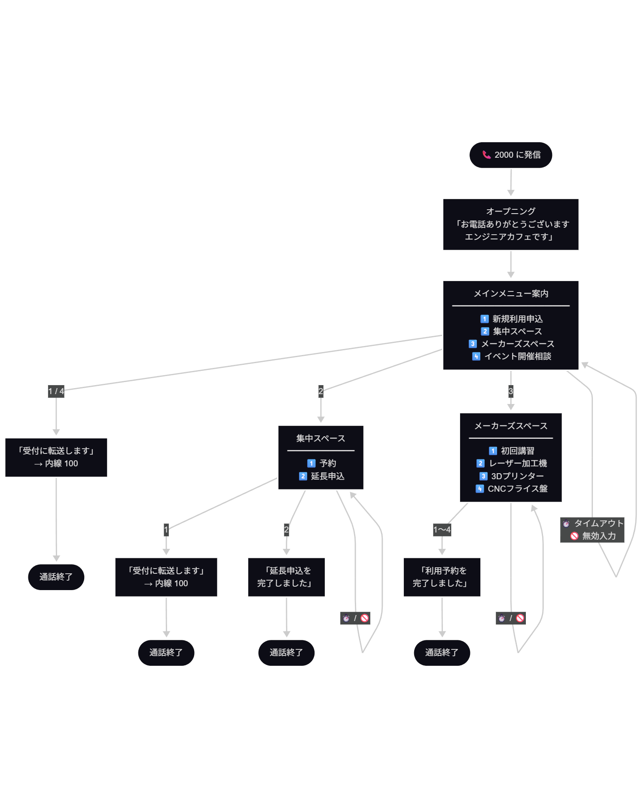

# Asteriskのダイヤルプラン設定編

<!-- 今回はAsteriskのダイヤルプラン設定について説明します。 -->

---

<!-- header: はじめに -->

# はじめに

<!-- まずはじめにですが -->

---

今回はAsteriskのダイヤルプラン設定について説明します。

DBやAGIを使用しない極めて基本的な､ダイヤルプランの前提知識について説明します｡

<!-- 今回はAsteriskのダイヤルプラン設定について説明します。 -->
<!-- DBやAGIを使用しない極めて基本的な､ダイヤルプランの前提知識について説明します｡  -->
<!-- あとは､今回時間があるか､動作させられれば､IVR動作デモを行う予定です -->

---

<!-- header: '' -->

# Asteriskとは?

<!-- まずAsteriskのことについて､簡単に説明します -->

---

<!-- header: Asteriskとは? -->

## Asteriskとは?

Asterisk（アスタリスク）は、アメリカアラバマ州のデジウム (Digium, Inc.) が開発していたオープンソースのIP-PBXのソフトウェア。ネーミングはアスタリスクマーク（＊）に由来する
1999年に初版がリリース
※ 現在は Sangoma がメンテナンス主体

https://www.asterisk.org
https://github.com/asterisk/asterisk


<!-- Asterisk とは アメリカアラバマ州のデジウム というところが開発していた OSSのIP-PBXソフトウェア です｡ -->
<!-- PBXとは「構内電話交換機」のことで、企業などが社内に設置する電話交換システムです。 -->
<!-- 外線（公衆回線）と内線（社内の電話）を繋いだり、内線同士を取り次いだりするのが主な役割です。-->

---

<!-- header: '' -->

# ダイヤルプランとは

<!-- 今回の本題である ダイヤルプランとは何かについて簡単に説明します -->

---

<!-- header: ダイヤルプランとは -->

Asteriskのダイヤルプランは、Asteriskが受け取った電話番号やコマンドをどのように処理するかを定義するルールの集合

ダイヤルプランは、Asteriskがどのように通話をルーティングし、どのようなアクションを実行するかを決定する

Asteriskの根幹となる機能であり､Asteriskを使用する上で最も重要な要素の一つ

通常`/etc/asterisk/extensions.conf`に定義される

<!-- Asteriskのダイヤルプランは、Asteriskが受け取った電話番号やコマンドをどのように処理するかを定義するルールの集合です。 -->
<!-- 受け取った番号に応じて､Asteriskがどのように通話をルーティングし、どのようなアクションを実行するかを決定するfileになっています｡ -->
<!-- Asteriskの根幹となる機能であり､Asteriskを使用する上で最も重要な要素の一つで､ 「エクステンションズ コンフ」というファイルで定義されます｡ -->
<!-- これ単体の書き味は構造化プログラミングが出る以前のプログラミング言語に近いらしいです｡ かなり アセンブリ や BASIC に近い -->

---

<!-- header: '' -->

# ダイヤルプランの構成

<!-- ダイヤルプランの構成に付いて説明します -->

---

<!-- header: ダイヤルプランの構成 -->

Asteriskのダイヤルプランは、大きく以下の要素で構成される

1. **コンテキスト (Context)**: ダイヤルプランの基本的な単位で、関連するルールをグループ化します。コンテキストは、特定の電話番号やコマンドに対して適用されるルールを定義
2. **エクステンション (Extension)**: 電話番号やコマンドを表す要素で、特定のアクションを実行するためのルールを定義します。エクステンションは、コンテキスト内で定義
3. **アクション (Action)**: エクステンションに関連付けられたコマンドや機能で、通話のルーティングや処理を実行します。アクションは、エクステンション内で定義

<!-- footer: コンテキスト: https://docs.asterisk.org/Configuration/Dialplan/Contexts-Extensions-and-Priorities/#dialplan-contexts <br> エクステンション: https://docs.asterisk.org/Configuration/Dialplan/Contexts-Extensions-and-Priorities/#dialplan-extensions <br> アクション: https://docs.asterisk.org/Configuration/Applications/ -->

<!-- おもに3つの要素で構成されます -->
<!-- 1つ目は「コンテキスト」です｡これは内線番号｡つまりSIPアカウントがどのダイヤルプランを使用するかを決定する､大まかな「グループ」と考えてください -->
<!-- 2つ目は「エクステンション」です｡これはダイヤルされた番号に対してどのような処理をするかを定義するものです｡ -->
<!-- 3つ目は「アクション」です｡これはエクステンションにマッチしたときに実際に何をするかを定義するものです｡ -->
<!-- 次で詳しく説明します -->


---

## コンテキストの役割

```
[内線ユーザー用]      [外線接続用]     [IVR用]
    ↓                   ↓              ↓
context: users   context: external  context: ivr
```

同じ拡張子番号でも、コンテキストが違えば別の処理ができる

<!-- footer: ''-->
<!-- コンテキストについてです -->
<!-- 基本的にSIPアカウントには1つのコンテキストしか設定できないのでコンテキストが違えば同じ extention が使用できます｡ -->
<!-- コンテキストから別のコンテキストのダイヤルプランに移行することもできるので､ 「コンテキスト = 名前空間 + ルーティングテーブル」と考えていいでしょう｡ -->

---

## 拡張子 (Extension) の概念

**拡張子** = マッチさせたい番号のパターン｡パターンマッチングは常に`_`から始まる

### パターンマッチングで使用される特殊文字

| 文字 | 意味 |
|------|------|
| `X`  | 任意の数字（0～9） |
| `Z`  | 任意の数字（1～9） |
| `N`  | 任意の数字（2～9） |
| `.`  | 任意の文字列（1文字以上）|
| `[]` | 文字クラス（例: `[13-6]`は*1, 3, 4, 5, 6*のいずれか） |
| `!` | 0文字以上の文字に即座に一致（例: `_9!`は*9*で始まる任意の文字列） |

<!-- footer: https://docs.asterisk.org/Configuration/Dialplan/Pattern-Matching/-->

<!-- 続いて拡張子についてです｡ extention とよく言います｡ -->
<!-- これはちょっと特殊な正規表現のようなものと考えてください｡ -->
<!-- パターンマッチングを使用する場合は 「アンダーバー」から始める必要があります｡ -->
<!-- 誰かが何かをダイヤルした時に「どの処理を実行するか」を決めるパターン｡内線のダイヤルでも外線のダイヤルでも同じ仕組みです｡ -->

---


### パターンマッチングの例

| パターン | マッチする番号 | マッチしない番号 |
|---------|---------------|-----------------|
| `201` | 201 | 202, 2010 |
| `_20X` | 201～209 | 200, 211 |
| `_2XX` | 200～299 | 199, 300 |
| `_2.` | 21, 29 , 2abc など（任意1文字以上） | 2 |
| `_[1-5]XX` | 100～599 | 099, 600 |

Asteriskはこれらのパターンを上から順番に照合します。

<!-- では、パターンマッチングのルールを表で整理してみます。 -->
<!-- 201や_2XXなど、いろんなパターンがありますが、 -->
<!-- 次のページでは、実際にこれらがどう動作するかをクイズで確認してみます。音は出ません｡動けばいいですけどね..... -->


---

パターンマッチングは **「より“具体的”で、マッチ範囲が狭いパターンが勝つ」** と考えてください。


例:
> アリスが内線6421にダイヤルするとして､以下のダイヤルプランからどの行がマッチするでしょうか？

```ini
exten => _6XX1,1,SayAlpha(A)
exten => _64XX,1,SayAlpha(B)
exten => _640X,1,SayAlpha(C)
exten => _6.,1,SayAlpha(D)
exten => _64NX,1,SayAlpha(E)
exten => _6[45]NX,1,SayAlpha(F)
exten => _6[34]NX,1,SayAlpha(G)
```

<!-- footer: https://docs.asterisk.org/Configuration/Dialplan/Pattern-Matching/#order-of-pattern-matching -->

<!-- パターンマッチングは「より具体的で､マッチ範囲が狭いパターンが勝つ」と考えてください -->
<!-- ここで問題です! 「アリスが内線6421にダイヤルするとして､以下のダイヤルプランからどの行がマッチするでしょうか？」-->
<!-- 30秒後に回答します -->
<!-- 30秒後: 30秒くらい経ったので答えです｡ (ダイヤル実行) 答えは「_64NX の E」です! -->
<!-- この理由として､ 6421の「2」に注目してください｡ Nは「2～9の数字」を表します -->
<!-- 2が一番最初にヒットするのは X ではなく N です｡ N は 2から9の数字を表し､「.」は任意の1文字以上 を指すので､より具体的なのは N つまり 64NX がヒットするということです｡ -->
<!-- 極めて面倒くさい｡ -->

---

## 優先度 (Priority) の概念

アプリケーション実行時の「順序番号」

```ini
[context]
exten => 200,1,Answer()          ; 優先度1：応答
exten => 200,2,Playback(hello)   ; 優先度2：音声再生
exten => 200,3,Hangup()          ; 優先度3：切断
```

各行は必ず連続した番号を持つ必要がある

### n をを使った書き方

```ini
exten => 200,1,Answer()
exten => 200,n,Playback(hello)   ; n = 次の番号（2）
exten => 200,n,Hangup()          ; n = 次の番号（3）
```

実務では`n`を使う方が便利です。

<!-- footer: https://docs.asterisk.org/Configuration/Dialplan/Contexts-Extensions-and-Priorities/#dialplan-priorities-->

<!-- 次に優先度について説明します -->
<!-- extenの2番目のパラメータ（1 や n）が優先度です -->
<!-- 実務では、最初は 1 を指定して、残りは n で統一するのが一般的です -->
<!-- さらに、同じextensionを続ける場合は exten の代わりに same を使えば、 -->
<!-- extensionの記述を省略でき、コードがスッキリします -->
<!-- この例では、Answer() の次から same で書き換えられますね -->


---

## アクション (Action) の概念

エクステンションにマッチしたとき、実際に**何をするか**を定義するもの

Asteriskでは「アプリケーション」とも呼ばれる

```ini
exten => 拡張子, 優先度, アクション(引数)
;                         ↑ここがアクション
exten => 200,1,Answer()
exten => 200,n,Playback(hello-world)
exten => 200,n,Hangup()
```

<!-- footer: https://docs.asterisk.org/Configuration/Applications/ -->

<!-- 続いてアクションについてです｡ -->
<!-- これはエクステンションにマッチしたときに「何をするか」を定義する関数です -->
<!-- 次ページで代表的なアクションについて説明しますが､たくさんある割にはそこまで使わない印象あります｡まぁ､要件次第です -->

---

## よく使うアクション

| アクション | 説明 |
|-----------|------|
| `Answer()` | 着信に応答する |
| `Hangup()` | 通話を切断する |
| `Dial(PJSIP/alice)` | 指定した相手に発信する |
| `Playback(filename)` | 音声ファイルを再生する |
| `Background(filename)` | 音声再生しながら入力を待つ |
| `WaitExten(秒)` | 拡張子の入力を待つ |
| `NoOp(テキスト)` | 何もしない（ログ・デバッグ用） |
| `GotoIf($[条件]?true:false)` | 条件分岐 |


<!-- footer: https://docs.asterisk.org/Configuration/Applications/ -->

<!-- これが基本的によく使用するアクションです｡ -->
<!-- その中でも特に注目していただきたいのが「NoOp」です｡ -->
<!-- これは「何もしない」アクションですが､デバッグとログ出力の目的で非常に重要です｡ -->
<!-- verboseログなどでも実行中のダイヤルプランは記録されますが､「何から始まったのか」「今どうなっているのか」を明確にするには､NoOpで明示的にメッセージを出す必要があります｡ -->
<!-- プログラミング言語におけるコメントのようなものと考えてください｡ -->

---

<!-- header: '' -->
<!-- footer: '' -->

# 変数

<!-- 続いて変数についてです -->

---

<!-- header: 変数 -->

変数を使用して情報を保存し、ダイヤルプラン内で利用できます。変数は、ユーザー定義のものとAsteriskが自動的に提供するものがある

https://docs.asterisk.org/Configuration/Dialplan/Variables/

<!-- 変数を利用することでダイヤルプラン内での情報管理や､条件分岐が可能になります｡ -->
<!-- 変数には自身が定義するものと着信時などに自動的に設定されるものがあります｡ -->

---

## グローバル変数

グローバル変数は、特定のチャネルにのみ存在する変数ではなく、システム上のすべての通話に関係する変数

定義方法は以下の通り

`[globals]`セクションにグローバル変数を定義
```ini
[globals]
MY_VAR=Hello, World!
```

ダイヤルプランの`GLOBAL()`関数と`Set()`アプリケーションを使用して、ダイヤルプランロジックからグローバル変数を設定

```ini
exten=>6124,1,Set(GLOBAL(MYGLOBALVAR)=somevalue)
```

<!-- footer: https://docs.asterisk.org/Configuration/Dialplan/Variables/Global-Variables-Basics/ -->

<!-- 1つ目がグローバル変数 です｡-->
<!-- グローバル変数はシステム上のすべての通話で共有される変数です -->
<!-- [globals] セクション、または GLOBAL() 関数と Set() アプリケーションで設定できます -->
<!-- プログラミングの環境変数のようなものと考えてください -->

---

## 組み込み変数

Asteriskには定義済の組み込み変数が多数存在する｡基本的には着信を受け取ったときに自動的に設定される

また､`Dial()`や`Hangup()`などのアクションを実行したときに自動的に設定される変数もある

ここではかなり頻繁に使用する組み込み変数をいくつか紹介

<!-- footer: 標準チャネル変数一覧: https://docs.asterisk.org/Configuration/Dialplan/Variables/Global-Variables-Basics/ <br> アプリケーションの戻り値一覧: https://docs.asterisk.org/Configuration/Dialplan/Variables/Channel-Variables/Asterisk-Standard-Channel-Variables/Application-return-values/ -->

<!-- 2つ目が組み込み変数です -->
<!-- システムが自動的に設定する変数で、基本的にはすべて読み取り専用です。 -->
<!-- 関数やアプリケーション実行時に更新されたり、通話発着信時に定義されるものが多いです。 -->
<!-- Asteriskには数多くの組み込み変数がありますが、ここでは実務で頻繁に使用するものをいくつか紹介します。 -->

---


| 変数 | 説明 | 例 |
|------|------|----|
| `${EXTEN}` | ダイヤルされた番号 | `1001` |
| `${CONTEXT}` | 現在のコンテキスト名 | `users` |
| `${CHANNEL}` | チャネル識別子 | `PJSIP/alice-00000001` |
| `${UNIQUEID}` | 通話のユニークID | `1700000000.1` |
| `${PRIORITY}` | 現在の優先度 | `2` |
| `${CALLERID(num)}` | 発信者の電話番号 | `090xxxxxxxx` |
| `${CALLERID(name)}` | 発信者の名前 | `Alice` |
| `${DIALSTATUS}` | `Dial()`の結果 | `ANSWER` / `BUSY` / `NOANSWER` |
| `${PLAYBACKSTATUS}` | `Playback()`の結果 | `SUCCESS` / `FAILURE` |

<!-- footer: ''-->

<!-- 基本的にどのダイヤルプランでも EXTEN はどこでも使われます｡ -->
<!-- あとは CALLERID(num) や UNIQUEID は 外部プログラムと連携する際によく使われたりします｡ -->

---

<!-- header: '' -->

# まとめ

<!-- まとめです -->

---

<!-- header: まとめ -->

- Asteriskのダイヤルプランは、コンテキスト、エクステンション、アクションで構成される
- パターンマッチングを使用して、ダイヤルされた番号に対して適切な処理を定義できる
- 優先度を使用して、複数のアクションを順序立てて実行できる
- 変数を使用して、通話に関する情報を保存し、ダイヤルプラン内で利用できる

<!-- Asteriskのダイヤルプランは、コンテキスト、エクステンション、アクションで構成されます -->
<!-- パターンマッチングを使用して、ダイヤルされた番号に対して適切な処理を定義できます -->
<!-- 優先度を使用して、複数のアクションを順序立てて実行できます -->
<!-- 変数を使用して、通話に関する情報を保存し、ダイヤルプラン内で利用できます -->
<!-- ここからはダイヤルプランがどのように機能しているか､実際に動かしてみようと思います｡ 時間は大丈夫そうですかね?????-->

---

<!-- header: '' -->
<!-- footer: '' -->

# おまけ 実際に動かしてみる

<!-- ここからは、実際に Asterisk のダイヤルプランを動かしてみます -->

---

<!-- header: おまけ 実際に動かしてみる -->

ここからは､「エンジニアカフェの受付システム」を想定して､IVRを体験します｡
特にガイダンス中に外部のアプリケーションに問い合わせるようなことはせず､ダイヤルプランだけで完結させる構成を例に説明します｡

今回のシチュエーションは「申し込み」に焦点を当てた内容になります｡

<!-- このサンプルでは「エンジニアカフェの受付システム」を想定してIVRを体験します -->
<!-- 特にガイダンス中に外部のアプリケーションに問い合わせるようなことはせず､ダイヤルプランだけで完結させる構成を例に説明します｡ -->

---



---

<!-- header: '来そうな質問' -->

## 来そうな質問

Q: 音質悪っ ^^;

A: **ಠ_ಠ** .........

`pjsip.conf`で使用可能なコーデックに`alaw`,`ulaw`などを指定していると音質が悪くなる｡(これらのコーデックはPSTN回線などで使用されるコーデックのため､サンプリングレートが8000Hzで音質が悪い)

`pjsip.conf`の`[endpoint]`セクションで、より高品質なコーデック（例: `opus`, `g722`）を指定することで、音質を改善できる｡

複数のコーデックを指定していると、**`allow=`の記述順によって意図しないコーデックが選ばれることがある。**`opus`だけ指定すれば確実。


---

Q: DTMFの方式は`rfc4733`でいいのか?

A: MicroSIPを始めとするソフトフォン､スマートフォン､IP電話機の多くは`rfc4733`方式をサポートしているため、**一般的には`rfc4733`を使用することが推奨される｡**

しかし､**お互いがサポートしていること前提になるので**､相手がアナログ電話機などを使用している想定の場合は､`inband`方式を使用することもある｡


- `rfc4733` = DTMFをRTPのイベントパケットとして送る方式｡よく使われる方式で､広くサポートされている｡
  - https://tex2e.github.io/rfc-translater/html/rfc4733.html
- `inband`方式は物理的に音を送る方式で､相手がアナログ電話機などを使用している場合に有効｡
  - 昔「電話機使って声で110番にかける」みたいなヤツがあったが､この方式を使用していると実現可能
  - https://ja.wikipedia.org/wiki/DTMF

---

Q: 内線発信として､番号以外でもできるの?

A: できます｡

```ini
; アルファベットで始まる番号にマッチさせる例
; この例では任意の一文字以上のアルファベットの単語のフォネティックコードを再生する
exten => _[A-Za-z]!,1,NoOp(アルファベット番号: ${EXTEN})
 same => n,Answer()
 same => n,SayPhonetic(${EXTEN})
 same => n,Hangup()
```