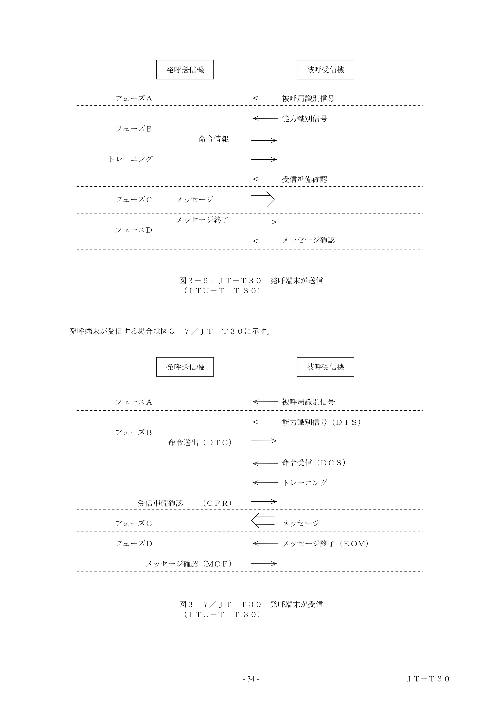
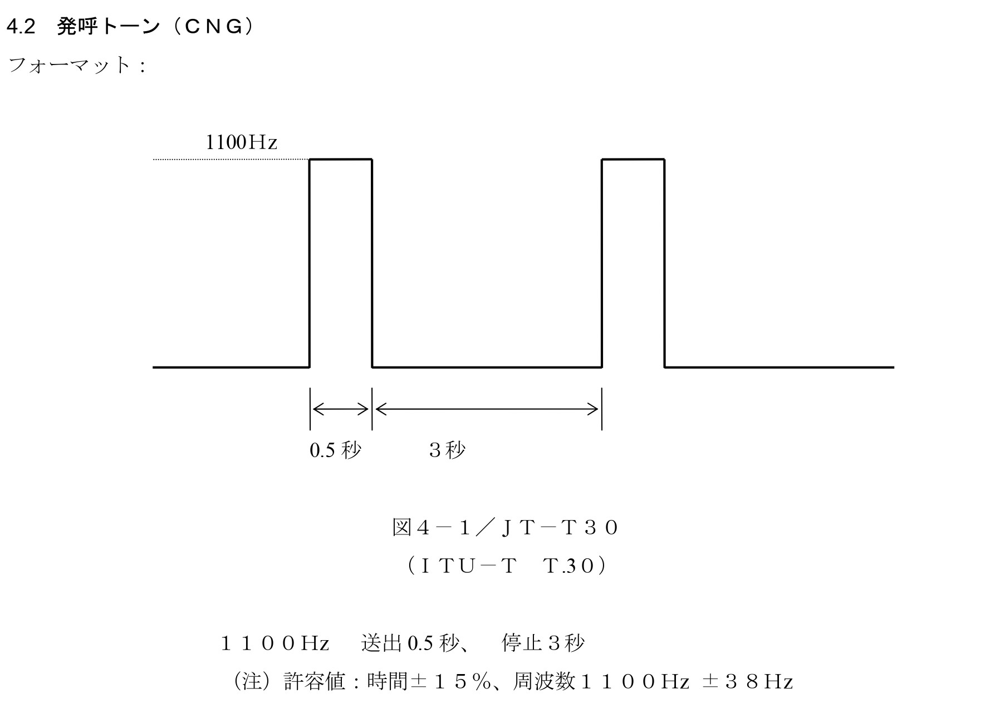

# Faxの「アレ」について
## FAXのプロトコルと音の意味について紹介

<!-- 今回はFAXの例のアレについて説明しようと思います -->

---

# はじめに

---

まずこの音声を聞いてみてください(memeとか詳しい人はなんとなくわかったかもしれません)

<audio controls src="./contents/fax-machine-sound-effect-made-with-Voicemod.mp3"></audio>

今回はこの音を出すためのプロトコルについて説明します

---

# そもそもFAXとは?

---

<!-- header: そもそもFAXとは? -->
<!-- footer: https://e-words.jp/w/FAX.html   https://www.soumu.go.jp/johotsusintokei/whitepaper/ja/s51/html/s51a01030202.html -->

## FAX【facsimile】ファクシミリ

> 電話回線を用いて遠隔地間で画像を送受信するシステム。特に、公衆回線の末端に専用の機器を接続し、書類などの原稿を読み取って相手の機器に送信、相手側で受信して印刷することができるもの。専用の機器（FAX機）のことをFAXということもある。

1843年イギリスの電気技師アレキサンダ・ベインによって発明されたと伝えられるが，これはグラハム・ベルによる電話機の発明より30年も前のことらしい
(総務省: 昭和51年版 通信白書)

割ともう日本だけしか使われていないかと思いきや通信の秘匿性を重視する組織(例えばアメリカ政府)ではまだまだ現役で使われているらしい

---

<!-- footer: https://e-words.jp/w/G3_FAX.html   https://www.ttc.or.jp/application/files/8215/5434/4915/JT-T4v13.pdf-->

現在のFAX仕様はITU-Tの**T.30**という規格で定められている｡**1988年11月25日**に制定

最新は T.30 Amendment 1 (2007年) で､割と最近まで改訂されていたことがわかる

また､よく使われるFAX規格は G3 FAX と呼ばれるもので､ITU-Tの**T.4**で定められている｡

かなり言い回しが紛らわしいが「**送信の仕方**」を定めたのが**T.30**で「**機械・画像のフォーマット**」を定めたのが**T.4**と覚えるとわかりやすいかもしれない

---

<!-- header: '' -->
<!-- footer: '' -->

# FAXのプロトコル

---

<!-- header: FAXのプロトコル -->

FAXは各フェーズに応じていくつかの音を出す

実はこの音はFAXのプロトコルに従って出されているものである

T30の場合はフェーズAからフェーズDまでの

次ページで今回登場する音ごとのプロトコル名とその役割について解説

---

<!-- footer: https://www.itu.int/rec/dologin_pub.asp?lang=e&id=T-REC-T.30-200509-I!!PDF-E&type=items -->

各フェーズは大体こんな感じの役割を持っている

| フェーズ | 内容 |
|---------|------|
| **Phase A** | 端末確認（お互い FAX と認識） |
| **Phase B** | 能力交換・設定決定・回線テスト |
| **Phase C** | 画像データ転送 |
| **Phase D** | ページ終了・切断処理 |

---

<!-- footer: '' -->

情報通信技術委員会 
JT-T30
一般交換電話網における文書ファクシミリ伝送手順

https://www.ttc.or.jp/application/files/3115/5434/5126/JT-T30v18.pdf

P.35 より手順を引用

---

<!-- footer: https://www.ttc.or.jp/application/files/3115/5434/5126/JT-T30v18.pdf   4.2 発呼トーン（ＣＮＧ） -->

## Phase A: CNG — Calling tone（発呼トーン） 

<audio controls src="./contents/cng.wav"></audio>

- 周波数：**1100 Hz** の正弦波
- パターン：**0.5秒 ON → 3秒 OFF** の繰り返し
- 意味①：非音声端末（＝ FAX）であることを識別させる
- 意味②：送信モードで**DIS:相手の応答を待っている**ことを示す

<!-- CNG は Calling Tone の略で、送信側が鳴らす「私は FAX 機ですよ」という自己紹介の音です。 -->
<!-- 1100Hz をピッと 0.5秒鳴らして、3秒無音、またピッ…というパターンを繰り返します。 -->
<!-- 意味は2つあって、1つ目は「私は FAX 機です、音声通話じゃないですよ」という識別。 -->
<!-- 2つ目は「相手からの応答が来たらすぐ送れます、送信準備完了ですよ」という通知です。 -->
<!-- 受信側はこの音を検知して、次の CED 信号で応答してきます。 -->

---

<!-- footer: https://www.ttc.or.jp/application/files/3115/5434/5126/JT-T30v18.pdf   4.1.1 被呼局識別信号（ＣＥＤ） -->

## Phase A: CED — Called terminal identification（被呼局識別信号）

CNG に対して**受信側が返す**「こちらも FAX です」という応答信号

<audio controls src="./contents/ced.wav"></audio>

- 周波数：**2100 Hz** の正弦波（連続）
- 長さ：**2.6〜4.0秒**（接続後 0.2秒の無音の後に送出）
- 意味：「**こちらも FAX 端末です。受信できます**」

<!-- CED は Called terminal identification の略で、受信側が CNG を検知した後に返す応答の音です。 -->
<!-- 2100Hz の音をブーッと約3秒、連続で鳴らします。 -->
<!-- 送信側はこの音を受け取ることで「相手も FAX 機だ」と確認して、次のフェーズへ進みます。 -->
<!-- ちなみにこの 2100Hz という周波数には副作用があって、電話回線のエコーキャンセラーを無効化します。 -->
<!-- FAX の音声通信では余計なエコー除去が邪魔になるので、それを止める効果もあるんですね。 -->

---

<!-- footer: https://www.ttc.or.jp/application/files/3115/5434/5126/JT-T30v18.pdf   5.3.6.1.1 初期識別（ＤＩＳ） / 5.3.6.1.3 受信命令（ＤＣＳ） -->

## Phase B: DIS / DCS — 能力交換

- 📥 **DIS**（Digital Identification Signal）**受信側から届く**
  「対応速度・用紙サイズ・符号化方式 etc. をお知らせします」
  > Characterizes the standard ITU-T capabilities of the called terminal.
  
  <audio controls src="./contents/dis.wav"></audio>

- 📤 **DCS**（Digital Command Signal）**送信側から送る**
  「では **この速度・この符号化方式** でお願いします」
    > The digital set-up command responding to the standard capabilities identified by the DIS signal.

  <audio controls src="./contents/dcs.wav"></audio>

<!-- Phase B は送受信機が「どんな条件で送るか」を決めるフェーズです。 -->
<!-- まず受信側から DIS が届きます。「私は 14400bps まで対応できます」という自己紹介です。 -->
<!-- それを受けて送信側が DCS を送り返して「じゃあ 9600bps でいきましょう」と確定します。 -->

---

<!-- footer: https://www.itu.int/rec/T-REC-V.21/en -->

## V.21 — バイナリ制御信号の変調方式

DIS・DCS などのバイナリ制御信号は **V.21 channel 2 FSK** で変調される

- **FSK**（Frequency Shift Keying）：0と1を**周波数の違い**で表現する変調方式
- **mark（1）= 1650 Hz** / **space（0）= 1850 Hz**
- ビットレート：**300 bps**

→ DIS と DCS が似た音に聞こえるのはこのため（変調方式が同じ）

<!-- DIS も DCS も、送るデータの内容は違いますが変調方式は同じ V.21 ch.2 FSK です。 -->
<!-- FSK は周波数を切り替えてビットを表現する方式で、1 を 1650Hz、0 を 1850Hz で表します。 -->
<!-- なので人間の耳には「同じような音」に聞こえる。これは仕様通りです。 -->

---

<!-- footer: https://www.ttc.or.jp/application/files/3115/5434/5126/JT-T30v18.pdf   5.3.6.1.3 受信命令（TCF） / 5.3.6.1.4 受信確認応答（CFR / FTT） -->

## Phase B: モデムトレーニング + TCF — 回線品質テスト

- 📤 **モデムトレーニング信号** ← これが「ﾋﾟﾖｫｫｫｫｫwwwwwww」の正体
  DCS で決めた速度でモデムが同期する
  <audio controls src="./contents/modem-training.wav"></audio>

- 📤 **TCF**（Training check）：その後 **1.5秒間ゼロデータ**を送信
  「本当にこの速度で届くか？」の確認テスト

- 受信側の判定（送信側に返ってくる）：
  - 📥 **CFR**（Confirmation to Receive）：「届きました。送ってください」
  - 📥 **FTT**（Failure to Train）：「品質が悪い。速度を下げて」→ DCSからリトライ

<!-- 「ﾋﾟﾖｫｫｫｫｫwwwwwww」の正体はモデムトレーニング信号です。 -->
<!-- DCS で決めた速度でモデムが同期するための信号で、周波数が変化しながら聞こえます。 -->
<!-- その直後に TCF、1.5秒間のゼロデータを送って「本当に届くか」を確認します。 -->
<!-- 受信側が OK なら CFR、ダメなら FTT で速度を落として DCS からやり直しです。 -->
<!-- なお TCF の「F」が何を指すのか仕様書には明記がなく、正直わかりませんでした。 -->
<!-- 業界では "Training Check Frame" と呼ばれることが多いようですが、確証は取れていません。 -->

---

<!-- footer: https://www.itu.int/rec/T-REC-T.30-200509-I!!PDF-E&type=items   Table 2/T.30（DCS ビット割り当て） / ITU-T T.4 §2（標準解像度 1728×1143 px） -->

## なぜ画像転送は別の変調方式なのか

**V.21（制御信号）は 300 bps**

T.4 標準解像度 A4（1728 × 1143 px）の未圧縮 2値データ ≈ **1.97 Mbit（≈ 242 KB）**

→ 300 bps で送ると… **約 110 分かかる** → 使い物にならない

| 規格 | 最大速度 | 未圧縮 A4 の計算値 |
|------|---------|-----------------|
| **V.27ter** | 4,800 bps | 約 7 分 |
| **V.29** | 9,600 bps | 約 3.5 分 |
| **V.17** | 14,400 bps | 約 2.3 分 |

※実際は MH 圧縮で大幅短縮。**回線品質が悪い** と速い方式では信号が壊れる → DCS で交渉

<!-- V.21 の 300bps で画像を送ろうとすると約 110 分かかります。さすがに使い物にならないですよね。 -->
<!-- 計算の根拠は T.4 標準解像度の A4、幅 1728 ピクセル × 縦 1143 ライン、これが約 1.97 Mbit です。 -->
<!-- だから画像転送には別の高速な変調方式を使います。 -->
<!-- でも速ければいいわけじゃなくて、回線品質が悪いと速い方式では信号が壊れてしまう。 -->
<!-- なので複数の速度が用意されていて、DCS の交渉で「うちの回線だとここまで出せます」とすり合わせるんです。 -->
<!-- これが TCF テストが重要な理由でもあります。 -->

---

<!-- footer: https://www.ttc.or.jp/application/files/3115/5434/5126/JT-T30v18.pdf   5.3.2.1 画像伝送の変調方式（V.27ter / V.29 / V.17） -->

## Phase C: FAX メッセージ転送

CFR のあと、改めてモデムトレーニング（省略）を経て画像データを送信

<audio controls src="./contents/message.wav"></audio>

- 📤 圧縮された画像データを**高速モデムで送信**
- 変調方式：**V.27ter / V.29 / V.17**（DCS で決定、V.21 より高速）
- 白黒2値データを MH / MR / MMR などの符号化で圧縮
- これが「ジャーーー」という音の正体

<!-- CFR で OK をもらったあと、もう一度モデムトレーニングをして本番に備えます。 -->
<!-- そしていよいよ画像データの本送信、あの「ジャーーー」という音です。 -->
<!-- 変調方式は制御信号の V.21 とは別物で、V.27ter・V.29・V.17 のいずれかを使います。 -->
<!-- DCS で交渉した速度に応じてどれを使うかが決まります。 -->
<!-- 画像は白黒の2値データとして読み取られ、MH などの符号化で圧縮してから送られます。 -->
<!-- 白い部分が多い文書ほど圧縮率が高くなるので、送信時間も短くなります。 -->

---

<!-- footer: https://www.ttc.or.jp/application/files/3115/5434/5126/JT-T30v18.pdf   5.3.6.1.6 メッセージ後コマンド（EOP / MPS） / 5.3.6.1.7 メッセージ後応答（MCF） / 5.3.6.1.8 DCN -->

## Phase D: 終了処理

この段階では特徴的な音は出ない。制御フレームの短いやり取りで完結する

| 信号 | 方向 | 意味 |
|------|------|------|
| **EOP** | 📤 送信側 → | 「全ページ送り終わりました」 |
| **MCF** | 📥 → 受信側 | 「正常に受信しました」 |
| **DCN** | 📤 送信側 → | 「切断します」（応答不要） |

複数ページがある場合は EOP の代わりに **MPS** を送り Phase C に戻る

<!-- Phase D は短い制御フレームをやり取りするだけなので、特徴的な音はありません。 -->
<!-- EOP で「以上です」、MCF で「受け取りました」、DCN で「切断します」という3ステップで終わります。 -->
<!-- これで FAX 通信は完了です。 -->

---

<!-- header: '' -->
<!-- footer: '' -->

## まとめ

FAX の「アレ」は**機械同士の会話**だった

<audio controls src="./contents/full-sequence.wav"></audio>

| 音 | 正体 | 意味 |
|----|------|------|
| ピッ…ピッ… | CNG（1100 Hz） | 「私は FAX です」 |
| ブーー | CED（2100 Hz） | 「こちらも FAX です」 |
| ガガガ（短） | DIS / DCS（V.21 FSK） | 「この設定で送ります」 |
| ﾋﾟﾖｫｫｫｫｫwwwwwww | モデムトレーニング | 「この速度で同期します」 |
| ジャーーー | 画像データ（V.27ter 等） | 「画像を送っています」 |

<!-- まとめです。 -->
<!-- FAX のあの音、全部ちゃんと意味があったんですね。 -->
<!-- 「ピッピッ」は私は FAX ですという自己紹介、「ブーー」は受信側の応答。 -->
<!-- ﾋﾟﾖｫｫｫｫｫwwwwwww -->
<!-- 次に FAX の音を聞いたとき、少しだけ違って聞こえるかもしれません。ありがとうございました。 -->

---