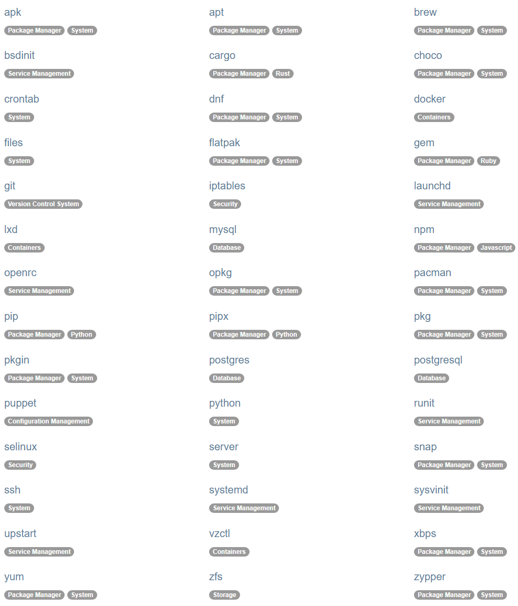

# Pyinfraについて
## Ansibleの比較についても

<!-- 今日はPyinfraっていうIaCツールを紹介したいと思います。 -->
<!-- ちょっと使ってみたのでその感想も交えながら話していきます。 -->

---

# Pyinfraとは？

<!-- まずPyinfraって何なの、というところなんですが -->

---

<!--header: Pyinfraとは？ -->
<!--footer: https://pyinfra.com <br> https://docs.pyinfra.com/en/3.x/performance.html#performance <br> https://github.com/pyinfra-dev/pyinfra/releases/tag/v1.0 -->


Pyinfraは、Pythonコードをシェルコマンドに変換し、サーバー上で実行する､その場限りのコマンドを実行したり、宣言型の操作を記述したりできる

SSHサーバー、ローカルマシン、Dockerコンテナを対象にできる

高速で、1台のサーバーから数千台規模まで拡張可能

いわゆる構成管理系のツール(IaC)でAnsibleのようなもの

Ansibleより**10倍速い**と公式で謳われている

> Think `ansible` but Python instead of YAML, and up to 10x faster.

<!-- Pyinfraとは､一言で言うと、AnsibleをYAMLじゃなくてPythonで書けるようにしたツールです。 -->
<!-- 対象ホストへのエージェント不要で、SSHさえ繋がればOKというのがポイントで。 -->
<!-- 公式サイトには「Ansibleと同じだけど、YAMLの代わりにPythonで、最大10倍速い」って書いてあります。 -->
<!-- 1.0がリリースされたのが2020年なので割と新しいツールです。 -->

---

<!--header: "" -->
<!--footer: "" -->

# インストール

<!-- インストールは一瞬なので軽く見ておきます。 -->

---

<!--header: インストール -->
<!--footer: https://docs.pyinfra.com/en/3.x/install.html -->

## uvを使う場合

ツールとして利用する場合
```bash
uv tool install pyinfra

pyinfra --version
```

既存プロジェクトに追加する場合
```bash
uv add pyinfra

uv run pyinfra --version
```

<!-- 最近はuvが使えることが多いと思うので、uvで入れるのが一番楽です。 -->
<!-- グローバルに使いたいなら `uv tool install`、プロジェクトに組み込むなら `uv add` ですね。 -->

---

## pipを使う場合

pipを使う場合もほぼ同じ
```bash
pip install pyinfra

pyinfra --version
```

<!-- uvが使えない環境ならpipでも普通に入ります。特に注意点はないです。 -->
<!-- 対象ホスト側にはPythonを入れる必要がないのも地味に便利なポイントです。 -->

---

<!--header: "" -->
<!--footer: "" -->

# Ansibleとの比較

<!-- Pyinfraはよくansibleと比較されるのでその辺りを整理します。 -->

---

<!--header: Ansibleとの比較 -->
<!--footer: https://pyinfra.com/ansible -->

| 観点 | pyinfra | Ansible |
|------|---------|---------|
| 記述言語 | **純粋なPython** | YAML + Jinja2 |
| 条件分岐 | `if/else` | `when:` + Jinja2フィルター |
| ループ | `for` 文 | `loop:` / `with_items:` |
| IDE補完・デバッグ | **フル対応** | 限定的 |
| 外部ライブラリ | `import` で何でも使える | 制限的 |

Pythonのライブラリを活用できることやIDEの補完が効くことが大きなメリット(流れをPythonで書けるため)

~~何よりサイトがわかりやすくて好き~~

<!-- 一番大きな違いは記述言語で、AnsibleはYAML＋Jinja2、PyinfraはただのPythonです。 -->
<!-- 条件分岐をAnsibleで書こうとすると`when:`句にJinja2フィルターを書く必要があって、慣れないと読みづらいんですよね。 -->
<!-- Pyinfraなら`if/else`で普通に書けるし、IDE補完も効くし、Pythonライブラリもそのまま使えます。 -->
<!-- あとこれは完全に個人の感想なんですが、公式サイトが見やすくて調べやすいのも地味に助かりました。 -->

---

<!--header: "" -->
<!--footer: "" -->

# 使い方

<!-- 実際にどうやって書くか見ていきます。 -->

---

<!--header: 使い方 -->
<!-- footer: https://docs.pyinfra.com/en/3.x/getting-started.html#create-a-deploy -->

ほぼAnsibleの考え方がそのまま流用できる

**デプロイ**(インベントリと操作の集合)を作成する｡

**デプロイ** = AnsibleのプレイブックやChefのクックブックのようなもの

<!-- Ansibleを知っていれば概念はほぼそのまま使えます。 -->
<!-- インベントリで対象ホストを定義して、デプロイファイルに実行したい操作を書く、という流れです。 -->
<!-- AnsibleのPlaybookがdeploy.pyになるイメージですね。 -->

---

まずは `inventory.py` を作成して、対象ホストを定義する

```py
# デプロイ対象のサーバーリスト
# pyinfra.host.name から参照可能
target_servers = [
    # dockerコンテナ内のsshサーバーに接続する例
    ("target-server",{
        "_sudo": True ,
        "ssh_hostname": "localhost",
        "ssh_user": "root",
        "ssh_password": "root",
        "ssh_port": 2222,
    }),
]
```

<!-- インベントリはPythonのリストで定義します。 -->
<!-- ホスト名と接続情報をタプルで書くだけで、YAMLの`hosts:`みたいな概念がそのままPythonに置き換わった感じです。 -->
<!-- `_sudo: True`を最初から設定しておくとデプロイファイル側で毎回書かなくてよくなります。 -->
<!-- つまりこの場合接続をrootで行うという意味になりますね -->

---

次に `deploy.py` を作成して、実行したい操作を定義する

この例では、`apt` モジュールを使って `asterisk` と `vim` をインストールする操作を定義している｡ 

`update=True` は`apt update` を実行してからインストールするオプション

```py
from pyinfra.operations import apt

# Update package list and install packages
apt.packages(
    name="Install Asterisk and Vim",
    packages=["asterisk", "vim"],
    update=True,
)
```

ファイルコピー(`files.copy`)や`Jinja2`テンプレートの利用(`files.template`)も可能

<!-- `deploy.py`はこんな感じで、ただのPython関数の呼び出しです。 -->
<!-- Debianの場合､`apt.packages()`にパッケージ名を渡すだけなので、見れば何をしているか一目でわかりますよね。 -->
<!-- Ansibleの`ansible.builtin.apt`と同じことをしているんですけど、YAMLより素直に読めると思います。 -->
<!-- ファイル操作系も`files`モジュールに揃っていて、Jinja2テンプレートもそのまま使えます。 -->

---

実行するときは以下のコマンドを実行する｡

```bash
pyinfra inventory.py deploy.py
```

Dockerを使ってテストすることもできる

https://docs.pyinfra.com/en/3.x/using-operations.html#using-operations

```bash
pyinfra @docker/ubuntu:20.04 deploy.py
```

Pyinfraではinventoryはオプションであり、コマンドライン引数でホストを指定することもできる

<!-- 実行はこのコマンド一発です。インベントリとデプロイファイルを渡すだけ。 -->
<!-- 便利なのがDockerでテストできる点で、実際のサーバーに繋がなくても`@docker/ubuntu:20.04`みたいに書くだけで、コンテナを立ち上げてその中で検証できます。 -->
<!-- 本番に流す前にDockerで動作確認してから、というフローが自然に組めます -->

---

実行すると実行結果が表示される

これはasteriskインストールから起動までを定義した`deploy.py`を2回実行したときの結果

ソースコードのダウンロードとユーザー・グループの作成は既に適用済みなので「No Change」となっている

```
pyinfra project/inventory.py project/deploy.py -y
--> Results:
    Operation                Hosts   Success   Error   No Change
    Asteriskのソースコードをダウンロード   1       -         -       1
    Asterisk用のグループを作成        1       -         -       1
    Asterisk用のユーザーを作成        1       -         -       1
    Asteriskサービスを有効化して起動     1       1         -       -
    Grand total              4       1         -       3

--> Disconnecting from hosts...
    - {target-server}
```

<!-- これが実際に動かしたときの出力です。 -->
<!-- 「No Change」が3つ出てるのが分かると思いますが、2回目の実行なので既に適用済みの操作はスキップされています。 -->
<!-- これが冪等性で、同じdeploy.pyを何度実行しても安全というやつですね。 -->
<!-- `Success`の1つだけが実際に変更があった操作で、サービスの起動状態だけが変化したということです。 -->

---



その他Operations（Ansibleでいうモジュール）も豊富に用意されている
https://docs.pyinfra.com/en/3.x/operations.html

特に`postgres`や`npm`などの特定のソフトウェアに特化したOperationsがあるのは便利で、Ansibleでいうところの`ansible.builtin.apt`や`ansible.builtin.yum`のような汎用的なモジュールもある

<!-- 左のリストがPyinfraで使えるOperations、Ansibleでいうモジュールの一覧です。 -->
<!-- `apt`・`yum`・`systemd`みたいな定番系はもちろん、`postgres`・`npm`・`git`みたいなソフトウェア特化のものもあります。 -->
<!-- 自分が使ったのは`apt`・`systemd`・`server`・`postgres`あたりで、一般的なサーバー構成ならだいたい揃ってる印象です。 -->

---

<!-- footer: https://docs.ansible.com/projects/ansible/latest/collections/ansible/builtin/index.html -->

Ansibleのほうがモジュール・コレクションは圧倒的に多い

pyinfraは**43のOperationsモジュール**（v3.x時点）
Ansibleは**ansible.builtin だけで85以上のモジュール**＋Galaxy上に数百のコレクション

複雑なサーバー構成の場合はAnsibleのほうが向いている

<!-- モジュールについてですが､ pyinfraのOperationsモジュールは43個です。一般的なサーバー構成には十分ですが、 -->
<!-- AnsibleはBuiltinだけで85以上、GalaxyにはAWS・Azure・ネットワーク機器など数百のコレクションがあります。 -->
<!-- なので複雑なサーバー構成を管理する場合はAnsibleのほうが向いていると思います。 -->

---

<!--header: "" -->
<!--footer: "" -->

# 結局どちらを選べばいいのか

<!-- じゃあ結局どっちを選べばいいの、てことですが｡ -->

---

<!-- header: 結局どちらを選べばいいのか -->
<!--footer: "" -->

Ansibleは成熟していて、モジュールも豊富で、コミュニティも大きい
一方で、PyinfraはPythonコードで書けることや高速であることが大きなメリット

個人的にAnsibleはディレクトリ(特にロール)やYAMLなど「構造」に意味を持っているというイメージがあり､Pyinfraは構造に意味を持たないというイメージがある

なので

- **Ansible**: 
  - SRE チームが存在し、組織的な運用フロー（レビュー・ロール分割・環境分離）が求められる場合
- **Pyinfra**: 
  - 小規模 or 単純なサーバー構成や個人での運用が多い場合やIaCに関するノウハウを持っていないがPythonの知識がある､複雑さを避けたい場合

このような選択基準があると思う

<!-- 基本的には､チーム運用が必要ならAnsible、Python書けるチームで小規模構成ならPyinfraという住み分けかなと思います。 -->
<!-- 個人的に感じたのは、Ansibleは「フォルダ構造やファイル名に意味がある」ツールで、Pyinfraは「Pythonのコードが全て」というツールだということです。 -->
<!-- Ansibleはrolsディレクトリや変数の置き場所など、従うべき規約があるので、チームで使うとある程度統一されやすいんですよね。 -->
<!-- 一方Pyinfraは自由度が高い分、書き方が人によってバラバラになりやすいので、最初にディレクトリ構成のルールを決めておくのが大事だと感じました。 -->
<!--  -->

---

<!--header: "" -->
<!--footer: "" -->

# まとめ

<!-- まとめです -->

---

<!--header: まとめ -->

- PyinfraはPythonコードでサーバー構成管理ができるAnsibleと同じIaCツール
- Ansibleより高速で、Pythonのライブラリも活用できる
- Ansibleの知識的な資産を流用しながらよりシンプルに記載できる
- Ansibleは成熟していてモジュールも豊富だが、Pyinfraは小規模な構成や個人での運用に向いている

<!-- PyinfraはPythonコードでサーバー構成管理ができるAnsibleと同じIaCツール です -->
<!-- Ansibleより高速で、Pythonのライブラリも活用できる というメリットがあります -->
<!-- Ansibleの知識的な資産を流用しながらよりシンプルに記載できる ので、Ansibleからの移行も比較的スムーズにできると思います -->
<!-- Ansibleは成熟していてモジュールも豊富だが、Pyinfraは小規模な構成や個人での運用に向いている という住み分けがあると思います -->
<!-- 試してみた感想としては、思ったよりちゃんと動いてくれて実用レベルだなという印象でした。 -->
<!-- YAMLを書かなくていいというのは地味にストレスが減るので、Pythonが普段から書けるチームには結構刺さると思います。 -->
<!-- 興味があれば`uv tool install pyinfra`一発で入るので、ぜひDockerとの組み合わせから試してみてください。ご清聴ありがとうございました。 -->
