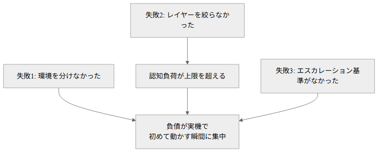

# ほぼAIだよりで作成したシステムの課題・反省点

<!-- 今日は、実装のほとんどをAIに任せて開発したシステムの話をします。 -->
<!-- 今回は反省点的なものです -->

---

# 何があったのか

<!-- まず、何があったのか軽く説明します。 -->

---

<!-- header: 何があったのか -->

GCP,Terraform,Fast API,FreeSwitch(PBX),Kamailio(SIP Proxy)を使ったシステムを開発。

実装のすべてをAI(Claude Code)に任せて進めた。

暦日75日・稼働52日でmainに498コミット。

パット見数字だけ見ると順調そう(?)

<!-- 詳しい中身は割愛しますが、実装のほぼ全ての部分をAI、具体的にはClaude Codeに任せて進めました。 -->
<!-- 数字で見ると、暦日(れきじつ)75日・稼働52日でmainに498コミット。ペースとしては悪くないように見えます。 -->

---

<!-- header: "" -->
<!-- footer: "" -->

# 結論

<!-- ただ、実際に振り返ってみると、ちょっと反省点がありました。 -->

---

<!-- header: 結論 -->

システムそのものは、なんだかんだありつつも最終的には問題なく動いている。

ただ、進め方には3つの構造的な失敗があった。

ここでいう「失敗」とは、システムが壊れたという意味ではなく、「気持ちよく、スムーズに開発を進められなかった」という観点の話。

<!-- システムそのものは、なんだかんだありつつも、最終的にはギリギリ問題なく動いています。 -->
<!-- ただ、進め方そのものには3つの構造的な失敗があったと思っていて、今日はその話をします。 -->
<!-- ここで言う「失敗」というのは、システムが壊れたとかそういう話じゃなくて、「気持ちよく、スムーズに開発が進まなかった」という意味で使ってます。 -->

---

<!-- header: "" -->
<!-- footer: "" -->

# 3つの失敗がどうつながったか

<!-- その3つが、どう絡み合っていたのかを図にしてみました -->

---

<!-- header: 3つの失敗がどうつながったか -->

定量的には fix:feat = 1.03。fixの約半数(145件中約69件、概算)が、実機で動かして初めて発覚するものだった。

<!-- 基本的には「認知負債に関する問題」が多く出てきたという印象です｡ -->
<!-- 何というか､ずっとレガシーなシステムの一番入りたての「プログラミング考古学」てきな､発掘作業が頻繁に発生する自体になりました｡ -->
<!-- あとは､負債が実機で初めて動かす瞬間に集中して爆発する、という構造です。 -->
<!-- 数字で見ると、機能を1つ作るごとに修正が1つ以上出ているような比率で、しかもその修正の約半分は実機でしか発覚しないものでした。 -->

---

<!-- header: "" -->
<!-- footer: "" -->

# 失敗1: 環境を分けなかった

<!-- まず1つ目、環境の話です。 -->

---

<!-- header: 失敗1: 環境を分けなかった -->

実験用の環境と、本番相当の環境を最初から分けなかった。

例えば「機能A」の確認や修正の結果「だけ」を確認したいだけなのに､他のメンバーも弄くってるかもしれない「開発環境」とやらをいちいち触らないといけなかったため､2人以上同じセクションの作業が同時に進められないまま、結果として「実機で初めて動かす瞬間」に負債が集中する構造になってしまった。

また､「作りながら直していこう」という進め方をしていたため､暫定措置のようなものが残り､それが「仮で置いておいたものか」「仕様として決まったものなのか」がかなり曖昧な状態で進んでしまった。

反省点としては「検証用のGCPプロジェクトをメンバー分(少なくともインフラ周りの作業をする人の分)用意しておくべきだった」ということ。

<!-- 実験用の環境と本番相当の環境を、最初から分けていませんでした。 -->
<!-- 例えば「機能Aだけ確認したい」みたいな場面でも、他のメンバーが触ってるかもしれない開発環境をいちいち使わないといけなくて。 -->
<!-- だから2人以上が同じセクションを同時に触れなくて、結局「実機で初めて動かす瞬間」に負債が集中する構造になっちゃったんです。 -->
<!-- あと、「作りながら直していこう」で進めていたので、暫定措置が残って、「仮置きなのか」「仕様として決まったものなのか」が曖昧なまま進んでしまいました。 -->
<!-- 反省点としては、検証用のGCPプロジェクトを、少なくともインフラ周りを触る人の分は用意しておくべきだった、ということです。 -->

---

<!-- header: "" -->
<!-- footer: "" -->

# 失敗2: レイヤーを絞らなかった

<!-- 2つ目は、担当範囲を絞らなかったことです。 -->

---

<!-- header: 失敗2: レイヤーを絞らなかった -->

GCPプロジェクトの作成から、Terraformでのインフラ構築、Fast APIでのアプリケーション実装、FreeSwitchやKamailioの設定、運用スクリプトの作成、監視設定、スケールアウトの検証を区切りをつけずにやっていた｡

複数同時にやるにしても、せめて「インフラ周り」「アプリ周り」「運用周り」の3つくらいに分けて、1人が同時に触るレイヤーの上限を2つまでに絞るべきだった。

<!-- GCPプロジェクトの作成、Terraformでのインフラ構築、FastAPIでのアプリ実装、FreeSwitchやKamailioの設定、運用スクリプト、監視設定、スケールアウトの検証まで、区切りをつけずに全部やっていました。 -->
<!-- 複数同時にやるにしても、せめて「インフラ周り」「アプリ周り」「運用周り」くらいには分けて、1人が同時に触るレイヤーは2つまでに絞るべきだったな、と思っています。 -->

---

<!-- header: "" -->
<!-- footer: "" -->

# 失敗3: エスカレーション基準がなかった

<!-- 3つ目は、判断を誰がするかのルールがなかったことです。 -->

---

<!-- header: 失敗3: エスカレーション基準がなかった -->

一次情報で裏が取れていない数値を実装に入れる場面や、仕様書に無い値を自分で決める場面が、機械的なルールなしに、その都度の判断で進んでいた。

こうした判断は、後から振り返ると一言確認すればすぐ済んだものが多かった。

判断の余地を残しておくと、忙しい時ほど確認が省かれてしまう。

<!-- 一次情報で裏が取れていない数値、例えば公式サイトの文言しか根拠がない数値を実装に入れたり、仕様書に無い値を自分で決めたり、というのが、その都度の判断で進んでいたんです。 -->
<!-- 後から振り返ると、その多くは一言確認すればすぐ済んだ話でした。 -->
<!-- 判断の余地を残しておくと、忙しい時ほど確認が省かれてしまうんだな、というのが今回の反省です。 -->
<!-- 特にSIP関係はプロバイダに直接問い合わせなければわからないような仕様などもあり､極論ですが「回答が来るまでは､暫定値すら置かずに待つ」といったことも必要だったのかもしれません｡これは反省1にも当てはまるかもしれません｡ -->

---

<!-- header: "" -->
<!-- footer: "" -->

# それでも機能した仕組み

<!-- ここまで反省点ばかりですが、うまくいったこともあります。 -->

---

<!-- header: それでも機能した仕組み -->

- git commit前に敵対的レビューを自動で挟む仕組み
- 実装について､「計画→実装→敵対的検証(別エージェントによるネガティブなレビュー)→修正→再レビュー」のサイクルを回す仕組み
- 教訓をmemoryとして積み上げ、セッションをまたいで引き継ぐ仕組み
- 実機への反映操作(apply・push)は必ず人間が行うという役割分担
- モノレポ構成にしたことで、複数のレイヤーを同時に触る場合でも、コンテキストの保持や変更の追跡が容易になった

<!-- 5つあります。まず、commit前に、実装した本人とは別の視点でレビューを自動で挟む仕組み。 -->
<!-- 実装についても、計画を立てて、実装して、別エージェントに敵対的にレビューさせて、直して、また見てもらう、というサイクルを回す仕組みにしていました。 -->
<!-- 教訓をmemoとして積み上げて、セッションをまたいで引き継ぐ仕組み。 -->
<!-- 実機への反映操作は必ず人間がやる、という役割分担。 -->
<!-- あと、モノレポ構成にしていたので、複数のレイヤーを同時に触るときでも、コンテキストの保持とか変更の追跡がしやすかったです。 -->

---

<!-- header: "" -->
<!-- footer: "" -->

# 次にやること

<!-- 最後に、次の案件で変えることをまとめます。 -->

---

<!-- header: 次にやること -->

- 実験用(単体機能の検証用など)・本番相当の環境を、最初から2つ用意する
- 同時に触るレイヤーの上限を2つまでに絞る
- 明らかに判断の余地がある場合､課題管理ツールにチケットを作ってエスカレーションする
  - Slackだと多分流れると思う

<!-- この3つです。まず、実験用の環境、単体機能の検証用みたいなものも含めて、本番相当の環境とは最初から2つ用意すること。 -->
<!-- 同時に触るレイヤーの上限を2つまでに絞ること。 -->
<!-- 明らかに判断の余地がある場面では、課題管理ツールにチケットを作ってエスカレーションすること。Slackだと多分流れてしまうと思うので。 -->

---

<!-- header: "" -->
<!-- footer: "" -->

# まとめ

- 負債の集中は、環境・スコープ・意思決定という進め方の設計に起因する
- 敵対的レビューの自動化・教訓の蓄積・実機操作の人間専管は、AI活用と両立する運用として機能した
- 次の案件では、進め方の設計を着手前に決めておく

<!-- まとめると、負債が集中したのは実機で初めて動かす瞬間で、原因は環境・スコープ・意思決定という進め方の設計にありました。 -->
<!-- 逆に、レビューの自動化や教訓の蓄積、実機操作を人間が握る、という部分はAI活用と両立してちゃんと機能しました。 -->
<!-- 次の案件では、この進め方の設計を、着手前に決めておこうと思っています。 -->
