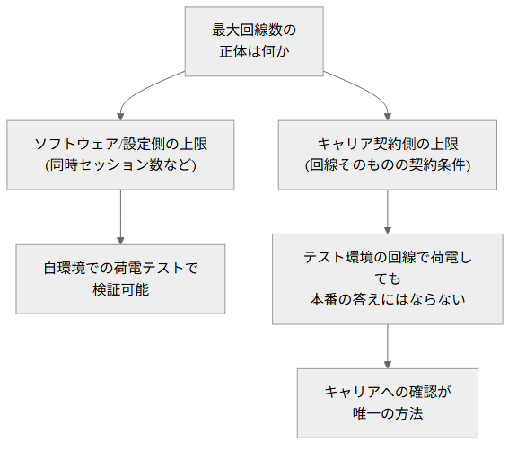

# カットしたスライド

LT本編から時間短縮のためにカットしたスライド原稿の退避場所。削除はせず、質疑応答や後日の参照で使う可能性があるものをここに置いておく。

---

## 細かい失敗

「それでも機能した仕組み」と「次にやること」の間に置いていたスライド(見出し+本文の2枚)。

カット理由:
- 本編の主題(3つの構造的な失敗)から外れた、周辺的な反省点だった
- 通しで話すと15分を超えたため、本筋に関係が薄いものから外した
- 台本の分量は約470字で、カット前の全体(約3,000字)の約15%を占めていた

戻す場合は、本編の「それでも機能した仕組み」の直後にそのまま貼り付ける。

以下、元のスライド原稿(質疑応答で「皆さんはどうしてますか?」と投げかけるときの材料):

---

# 細かい失敗

<!-- あと、ちょっと細かい失敗の話も挟ませてください。 -->

---

<!-- header: 細かい失敗 -->

- git worktreeとTerraformのstateファイルの相性が悪く、別ブランチでのdestroy操作などができなかった
- 複数のworktreeで並行してインフラ系タスクを見るとき、管理が煩雑になった
- 設計書はもちろん、技術的発見の記録もほぼ残せておらず、個人的には一番の失敗だと感じている
- 設計書のフォーマット・保存場所がメンバーごとに不統一だった(PowerPoint+Slack/Backlog、Markdown+リポジトリ、など)

AsciiDocやTypstのような組版エンジンか、リポジトリ内Wikiに統一しておくべきだったか、正直まだ迷っている。

<!-- git worktreeとTerraformの相性が、若干悪い感じがしていて。 -->
<!-- stateファイルがworktreeごとに分かれてしまうので、複数のworktreeで同じstateを参照できなくて、「mainで作ったリソースを別ブランチでdestroyする」みたいな操作ができなくなるんです。 -->
<!-- あと、複数のインフラ系タスクを並行して見るときも、worktreeの管理自体が煩雑になりました。 -->
<!-- それと、Documentationの管理も煩雑で。設計書は当然として、技術的な発見の記録までignoreしてしまったのは、個人的にはかなり失敗したと感じています。 -->
<!-- 人によって設計書のフォーマットや保存場所もバラバラで。例えばある人はパワーポイントでSlackかBacklog、自分はMarkdownでBacklogかリポジトリの中、みたいな感じでした。 -->
<!-- AsciiDocやTypstみたいな組版エンジンを使うか、Wikiをリポジトリに突っ込んでおけばよかったのかな、と今は思っています。皆さんはどうしてますか? -->

---

## 余談: エスカレーションの回避策について

「まとめ」の後ろに置いていた補足スライド(見出し+本文の2枚)。

カット理由:
- もともと「あくまでも補足。追加質問のような扱い」としていた内容だった
- 台本の分量は約240字で、本編の結論(3つの失敗)を変える内容ではなかった
- 質疑応答で「他に回避策はないのか」と聞かれたときの回答・問いかけに向いている

戻す場合は、本編の「まとめ」の直後にそのまま貼り付ける。図の元ファイルは `mermaid/回線上限の検証方法.mmd`、画像は `画像/回線上限の検証方法.png`。

以下、元のスライド原稿:

---

<!-- header: "" -->
<!-- footer: "" -->

# 余談: エスカレーションの回避策について

<!-- 最後に、ちょっとした余談です。 -->

---

<!-- header: 余談: エスカレーションの回避策について -->

回線(キャリア契約)側の上限だけは、テスト環境でどれだけ検証しても本番の答えにならない。ここの代替策はまだ思いついていない。

<!-- エスカレーションの話には、実はもう一つ回避策があるかもと思っていて。 -->
<!-- 「最大回線数」みたいな、1次情報が信用できない数値って、スクリプトで実際に架電しまくって限界を確認する、って手もあったはずなんです。 -->
<!-- ただこれ、本番と同じ回線じゃないと意味がなくて。ソフト側の上限なら自分の環境でも検証できるんですが、回線側の上限は、テスト環境でいくら確認しても本番の答えにはならないんですよね。 -->
<!-- ここの代替策は正直まだ思いついてません。皆さんならどうしますか? -->

---

## 重複整理で削った文言

見出しスライドのセリフと本文スライドの冒頭が同じ予告になっていた箇所などを整理したときに削った文言。戻す場合は元の位置に貼り戻す。

- 失敗1(本文)のセリフ冒頭「まず1つ目、」: 見出しのセリフ「まず1つ目、環境の話です。」と重複していた
- 失敗3(本文)のセリフ1行目「3つ目、判断を自分だけで決めていいか、誰かに確認すべきかのルールがありませんでした。」: 見出しのセリフ「3つ目は、判断を誰がするかのルールがなかったことです。」と同じ主張だった
- 次にやること(本文)のセリフ冒頭「次の案件で変えるのは」: 見出しのセリフ「最後に、次の案件で変えることをまとめます。」と重複していた
- それでも機能した仕組み(本文)のセリフ冒頭「うまく機能した仕組みは」: 見出しのセリフ「うまくいったこともあります。」と重複していた
- まとめの3つ目の箇条書きとセリフ「環境分離・レイヤー制限・エスカレーション基準の3点(3つ)を」: 直前の「次にやること」と同じ3項目の再列挙だった。「進め方の設計を着手前に決めておく」に圧縮した
