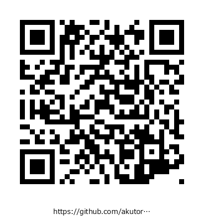
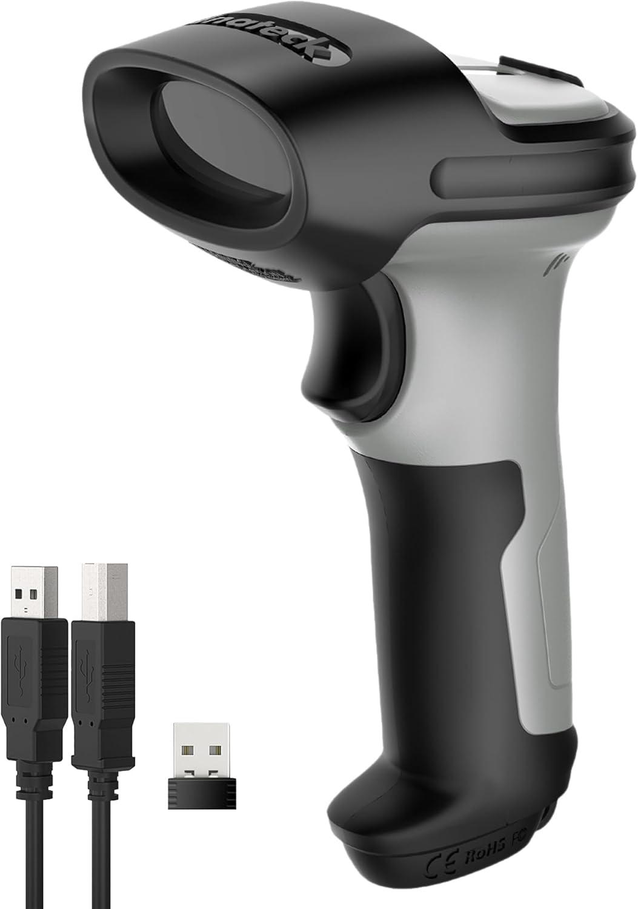

# 文字化けの犯人はQRじゃなかった

## ～業務用スキャナー選定で文字化けを避けるために～

<!-- 今日はですね、QRについての 話をします。 -->
<!-- んで始める前に少しだけ俺が作ったものの説明をするんですが｡ -->

---

## スキャナーを買った理由

<!-- footer: https://github.com/akutori/qr-barcode-generator -->

保守連絡時などで業務ID?(おそらく商品種別的なもの?)をバーコードにして､スキャナーで読み取り→入力画面に反映させる人が社内にいた｡

それに **「感動」** して、業務用スキャナー（Inateck BCST-72）を衝動買いしつつ、QRコード・バーコードを生成するツールも自作。個人的に運用していました

内容の割にはちょっとは役に立っている模様

~~最近AIを使ってツールを作るのは楽しいと感じる!!!!!~~

<!-- 何人かに喋ったと思いますが｡ 保守連絡時などでスキャナーを使って業務ID?か商品種別かなにかのIDをバーコードにして印刷したものをスキャナーを使って読み取って使っている人がいました｡ -->
<!-- 俺はそれに感動して、業務用のスキャナーをamazonで衝動買いしつつ、今年の5月くらいに突貫でQRとバーコードを作成・管理・運用するツールも自作しました。 -->
<!-- なぜかいろんなユースケースが見つかって､謎に役に立っている感じです｡ -->

---

<!-- footer: "" -->

# 何があったのか

<!-- では何が問題だったのかについてですが -->

---

<!-- header: 何があったのか -->

自作したQR・バーコード生成ツールで日本語入りのQRコードを作り、このスキャナーで読み取ってみたところ、**文字化けする**という問題が発生(windows11で発生)

スマホのカメラで読む分には問題なし。業務スキャナー読み取りで文字化けしていた

PCの設定などで使おうと思っていたが､出力が文字化けして使い物にならないため、業務用スキャナーでの文字化けを回避する方法を調査することにした

<!-- 自作したツールで日本語入りのQRコードを作って、さっき話したこのスキャナーで読み取ってみたら、文字化けする問題が発生したんです。 -->
<!-- スマホのカメラで読む分には全然問題ないんです。 -->
<!-- 業務用スキャナー使ったときに文字化けするのと､キッティングでこの作ったアプリを使っていたので､大層イライラしたので､解決を試みました -->

---

<!-- header: "" -->
<!-- footer: "" -->

# 最初の問題 : 文字コード

<!-- まぁ、最初に疑ったのはやっぱり文字コードなんですよ。 -->

---

<!-- header: 最初の問題 : 文字コード -->

QRコードの仕様上、中身はただのバイト列。「どの文字コードで解釈するか」の指定をもたない｡(ただ､特に指定がなければ**ISO/IEC 8859-1**で解釈するのが仕様上のデフォルト)

一方漢字・かなについては､通称「**Shift-JIS**」で解釈される仕様の模様

自分が使っていたIMEがGoogle IMEだったため､Shift-JISでエンコードすれば日本語の文字化けが解消された

→ 対策として UTF-8 / Shift-JIS を選んで生成できる機能を実装した

<!-- QRコードって中身はただのバイト列で、文字コードの情報は持ってないんですよ。 -->
<!-- 仕様上は、指定がなければISO/IEC 8859-1、つまりヨーロッパ系の文字コードで解釈するのがデフォルトなんです。 -->
<!-- でも漢字とかかなについては、慣習的にShift-JISで解釈されることになってるみたいで。 -->
<!-- 自分が使ってたのがGoogle IMEだったので、Shift-JISでエンコードしたら日本語の文字化けが直ったんですよね。 -->
<!-- なのでUTF-8とShift-JISを選んで生成できる機能を作りました。 -->

---

<!-- footer: https://learn.microsoft.com/ja-jp/windows/win32/intl/character-sets -->

ただ､Microsoft IMEを使っていると､Shift-JISやBOM付きUTF-8でエンコードしても文字化けした

Microsoft IMEの解釈文字コードはUTF-16らしく、どうあがいても文字化けした

> Windows アプリケーションは Unicode の UTF-16 実装を使用します。 UTF-16 では、ほとんどの文字は 2 バイト コードで識別されます。

実際にUTF-16でQRコード自体は生成できたが、IME×スキャナー側の解釈設定の**全組み合わせ**で読み取りに失敗。そもそもUTF-16エンコードのQRコード自体が一般的ではなく、別のアプローチが必要だった

<!-- ただ、これで解決したと思ったら、Microsoft IMEを使ってる環境だとShift-JISやBOM付きUTF-8でエンコードしても文字化けするんですよ。 -->
<!-- 調べたら、Microsoft IMEが解釈する文字コードってUTF-16らしくて、これじゃどうあがいても文字化けするなと。Windowsのドキュメントにも、Windowsアプリは基本UTF-16を使うって書いてあるんですよね。 -->
<!-- 実際にUTF-16でQRコードを作ってみたら、生成自体はできたんです。でもIMEとスキャナー側の解釈設定、全部の組み合わせを試しても読み取りに失敗して。そもそもUTF-16のQRコード自体が一般的じゃないので、別のアプローチが必要でした。 -->

---

<!-- header: "" -->
<!-- footer: "" -->

# スキャナーの接続方式

<!-- で、そもそもスキャナーの接続方式っていくつかパターンがあるんですよ。 -->

---

<!-- header: スキャナーの接続方式 -->
<!-- footer: "" -->

スキャナーはおおよそ3種類程度の接続方式を提供している

- **HID キーボードエミュレーション**（今回の犯人はこれ）
  - PCには**仮想キーボード**として認識され、読み取った文字列をキーボード入力として注入する
  - ゼロ設定で動くのが売りだが、IME・キーボード配列の設定を直接受けてしまい、非ASCIIは力技に頼る構造上、日本語で詰まりやすい

<!-- スキャナーに限らずかもですが、だいたい3種類くらいの接続方式があるみたいなんですよ。 -->
<!-- 1つ目がHIDキーボードエミュレーションで、今回の犯人はまさにこれです。PCには仮想キーボードとして認識されて、読み取った文字列をキーボード入力として注入するので、IMEやキーボード配列の設定をダイレクトに受けちゃうんですよね。ゼロ設定で動くのが売りですが、非ASCIIは力技に頼る構造なので日本語で詰まりやすいんです。 -->

---

- **COM ポート（仮想シリアル）モード**
  - USB や Bluetooth Classic の SPP（Serial Port Profile）で「ただのシリアルポート」として見える
  - 生バイト列をアプリ側が自分でデコードするので IME もキーボードエミュレーションも一切関係ない
    - Zebra/Honeywell/Datalogic 等の老舗スキャナーは数十年前からこれに対応しており、業務システムでは実はこちらが「本命」の接続方式
  - **今回買ったスキャナーはこれに非対応**で、選べなかった

<!-- 2つ目がCOMポート、仮想シリアルモードです。生のバイト列を自分でデコードするので、IMEもキーボードエミュレーションも一切関係なくなります。 -->
<!-- 実はZebraとかHoneywellみたいな老舗のスキャナーメーカーは、昔からこっちに対応してるんですよね。業務システムだと実はこっちが本命の接続方式なんです。ただ今回買ったスキャナーはこれに対応してなくて、選べなかったんですよね。 -->

---

- **BLE GATT + 独自 SDK**
  - Bluetooth Classic の SPP に相当する標準規格が BLE には存在しないため、各社が独自プロトコル を作らざるを得ない
  - Inateck が特別面倒なのではなく、BLE 専用機はこの面倒さから逃れられないというのが実情
  - **実際に確認したところ**、公式SDKなしでは中身を解析できないベンダー独自プロトコルだった

<!-- 3つ目がBLE GATT + 独自SDKです。今回のスキャナーはこれしか選べませんでした。 -->
<!-- 実際に接続して確認もしてみたんですけど、公式SDKなしでは中身を解析できないベンダー独自のプロトコルでした。 -->

---

<!-- header: "" -->
<!-- footer: "" -->

# じゃあどうすればいいのか

<!-- じゃあ実際、機種選定とかアプリ作りではどうすればいいのか、という話です。 -->

---

<!-- header: じゃあどうすればいいのか -->

機種を選ぶ前に、まず「読み取ったデータを何に使うか」を明確にする

- **専用アプリでデータを受け取り、処理・登録する場合**：
  - **COM/SPP対応機種を選ぶ**
  - 生バイト列を自分でデコードできるので、この手の文字化けはそもそも起きない
  - 他のPCでも利用することを想定している場合(つまり、スキャナーを使うPCの環境が統一されていない場合)も、COM/SPP対応機種を選ぶのが無難
- **既存の入力欄にIDを流し込むだけで足りる場合**：
  - HIDキーボードエミュレーションで十分
  - ただしQR/バーコード側にはID等ASCII安全な値だけを入れる設計にする
  - JANやISBNなどの規格バーコードは、そもそもASCII安全な値しか入らないので、HIDキーボードエミュレーションでも文字化けしない

<!-- 機種を選ぶ前に、まず読み取ったデータを何に使うかを明確にするのが大事です。 -->
<!-- 専用アプリでデータを受け取って処理したり登録したりする場合は、COM/SPP対応の機種を選ぶのが一番です。生バイト列を自分でデコードできるので、この手の文字化けはそもそも起きません。 -->
<!-- あと、他のPCでも使うことを想定してる場合、つまりスキャナーを使うPCの環境が統一されてない場合も、この方式を選択した方が良いと思います。 -->
<!-- 逆に、既存の入力欄にIDを流し込むだけで足りる場合は、HIDキーボードエミュレーションで十分です。ただしQRとかバーコード側にはID等のASCII安全な値だけを入れる設計にする必要があります。 -->
<!-- 冒頭で紹介した、業務IDをバーコード化して入力画面に読み込ませてる人間のケースが、まさにこれなんですよね。 -->
<!-- JANとかISBNみたいな規格バーコードは、そもそも数字だけでASCII安全な値しか入らないので、HIDキーボードエミュレーションでも文字化けしないんです。 -->

---

<!-- header: "" -->
<!-- footer: "" -->

# まとめ

<!-- まとめです -->

---

<!-- header: まとめ -->

- QRコードの生成方式ではなく、読み取り方式によって挙動が大きく変わる
- HIDキーボードエミュレーションが原因。PCに仮想キーボードとして認識され、IME・キーボード配列の影響を直接受ける転送方式だった
- スキャナーの接続方式は事前に確認しておきたい
- 選定基準は「読み取ったデータを何に使うか」（詳しくは前ページの通り）

<!-- 今回のポイントは、QRコードの作り方よりも読み取り方式によって挙動が大きく変わる、ってことなんですよね。文字コードを選び直しても解決しなかったのが、まさにそれを物語ってます。 -->
<!-- HIDキーボードエミュレーションが原因でした。PCに仮想キーボードとして認識されて、IMEとかキーボード配列の影響を直接受けちゃう転送方式だったんです。 -->
<!-- スキャナーの接続方式は事前に確認しておきたいですね。本命のCOM/SPPモードは今回選べなくて、BLE専用機だと独自プロトコルの沼にもハマったので。 -->
<!-- 選定基準は、読み取ったデータを何に使うかから逆算する｡です。 -->

---

<!-- header: "" -->
<!-- footer: "" -->

# 想定質問

<!-- ここからは質疑応答用に、聞かれそうなことをいくつか先回りしておきます。 -->

---

<!-- header: 想定質問 -->

**Q. Web Serial APIを使えばブラウザから直接読ませられたのでは？**

実はブラウザから直接COMポートを叩ける「Web Serial API」という仕組みがある。ただし対応は実質Chrome系のみ。Safariは非対応、Firefoxも対応したばかりで、会社標準のブラウザで確実に動かしたい業務アプリだとHIDの方が現実的

**Q. Macの場合はどうなるのか？**

未検証。ただしAlt+NumpadはWindows固有の仕組みなので、同じ現象（Num Lockの点滅）は起きないはず。HIDキーボードエミュレーションであること自体は変わらないため、入力方式の影響を受けるという根本原因は同様に起きうる

<!-- 1つ目、Web Serial APIを使えばブラウザから直接読ませられたのでは、という質問ですね。 -->
<!-- 実はブラウザから直接COMポートを叩ける「Web Serial API」って仕組みもあるんですが、対応してるのは実質Chrome系だけなんですよね。 -->
<!-- Safariは今も非対応、Firefoxもつい最近やっと対応したばかりなので、会社標準のブラウザで確実に動かしたい業務アプリだと、結局HIDの方が現実的なんですよね。 -->
<!-- 2つ目、Macの場合はどうなるのか、という質問ですが、正直Macでは試せていません。 -->
<!-- ただAlt+NumpadってそもそもWindows固有の仕組みなので、同じ現象は起きないはずです。 -->
<!-- とはいえHIDキーボードエミュレーションであること自体は変わらないので、入力方式の影響を受けるという根本原因は同じように起きると思います。 -->

---

<!-- header: 想定質問 -->

**Q. クリップボード経由（コピペ）なら回避できたのでは？**

HIDキーボードエミュレーションは「キーボードとして認識される」仕組みで、クリップボードへの書き込み自体ができない（USBキーボード規格にクリップボード操作は含まれない）。実現するにはCOM/SPP等で受け取ったデータを、アプリ側で自前でクリップボードに書き込む実装が別途必要

**Q. QRじゃなくバーコードにすれば良かったのでは？**

自作ツールのバーコード（Code128）は元々ASCII文字のみ対応。バーコードは規格上ASCII安全な値が前提になっていることが多く、この手の文字化け自体が起きにくい。JAN/ISBNの話と同じ理屈で、最初からIDだけ持たせる設計にしていれば問題は起きなかった

<!-- 3つ目、クリップボード経由、コピペならどうかという質問ですが、そもそもHIDキーボードエミュレーションはキーボードとして認識される仕組みなので、クリップボードへの書き込み自体ができないんですよ。 -->
<!-- USBのキーボード規格にクリップボード操作は含まれていないので。やるならCOM/SPPとかで受け取ったデータを、アプリ側で自分でクリップボードに書き込む実装が別途必要になります。 -->
<!-- 4つ目、QRじゃなくバーコードにすれば良かったのでは、という質問ですね。 -->
<!-- 実は自分のツールでもバーコードは最初からASCII文字しか対応してないんです。バーコードって規格上、ASCII安全な値が前提になってることが多いので、そもそもこの手の文字化けが起きにくいんですよね。 -->
<!-- JANとかISBNの話と同じ理屈で、最初からIDだけ持たせる設計にしていれば、QRだろうがバーコードだろうが問題は起きなかった、というのが結論です。 -->

---

<!-- header: 想定質問 -->

**Q. 他のスキャナー（Zebra/Honeywellなど）なら最初から問題なかったのか？**

可能性は高い。「スキャナーの接続方式」で触れた通り、老舗メーカーはCOM/SPPモードに対応していることが多い。今回はInateckの安価なBLE専用モデルを選んだことが、そもそもの選定ミスだったかもしれない

**Q. なぜGoogle IMEとMicrosoft IMEで結果が違ったのか、結局わからなかったのか？**

正直、原因は特定できていない。同一ロケールでIMEだけ切り替えて検証したため、システムロケールの違いが原因でないことは確認済みだが、それ以上は追いきれなかった

<!-- 5つ目、他のスキャナーなら最初から問題なかったのか、という質問ですが、可能性は高いと思います。 -->
<!-- 本編でも触れた通り、ZebraとかHoneywellみたいな老舗メーカーはCOM/SPPモードに対応してることが多いので。 -->
<!-- 今回はInateckの安価なBLE専用モデルを選んだこと自体が、そもそもの選定ミスだったのかもしれません。 -->
<!-- 6つ目、なぜGoogle IMEとMicrosoft IMEで結果が違ったのか、結局わからなかったのか、という質問ですが、正直、原因は特定できていません。 -->
<!-- 同じロケール設定でIMEだけ切り替えて試したので、システムロケールの違いじゃないのは確認済みなんですけど、それ以上は追いきれませんでした。 -->

---

<!-- header: 想定質問 -->

**Q. QRの「漢字モード」を使えば良かったのでは？**

QR仕様にはShift-JISの日本語を効率的に格納する専用の「漢字」モードがある。ただしこれはQRコード内部でのデータの詰め方（生成側）の話で、スキャナーが読み取った後にどう転送するか（今回の本当の原因）とは別の層の話。漢字モードを使っていても、今回の問題は変わらず起きていたはず

<!-- 7つ目、QRの漢字モードを使えば良かったのでは、という質問ですね。 -->
<!-- 実はQRコードの仕様には、Shift-JISの日本語を効率的に格納するための専用の漢字モードっていうのがあるんです。 -->
<!-- ただこれ、QRコード内部でのデータの詰め方が変わるだけの話で、スキャナーが読み取った後にどうやってPCに転送するかっていう、今回の本当の原因とは別の層の話なんですよね。 -->
<!-- なので漢字モードを使っていても、今回の問題は変わらず起きていたと思います。 -->
