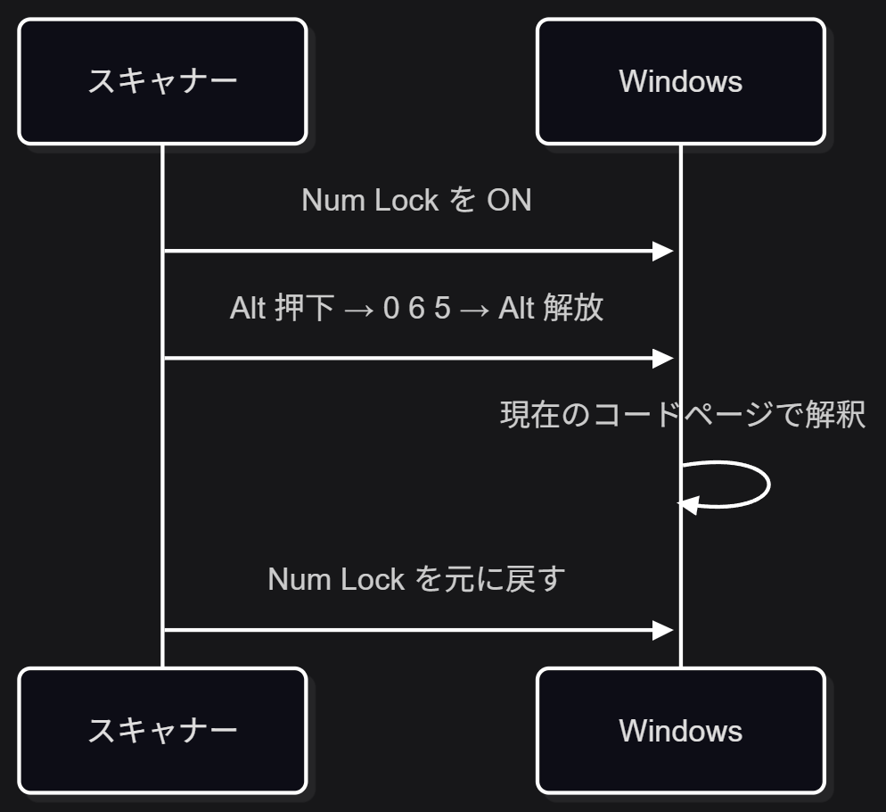
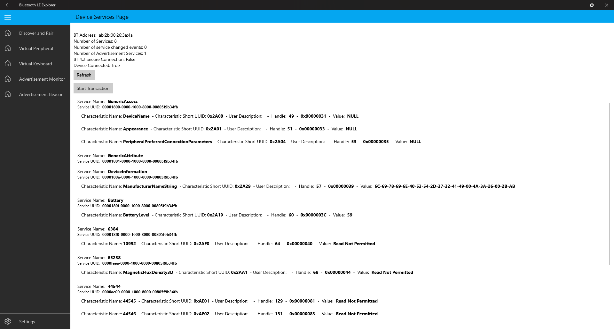

# カットしたスライド

LT本編から時間短縮・内容重複の整理のためにカットしたスライド原稿の退避場所。削除はせず、質疑応答などで使う可能性があるものをここに置いておく。

---

## Num Lockが点滅する

「スキャナーの接続方式」節のHID箇条書きに要点（PCには仮想キーボードとして認識され、読み取った文字列をキーボード入力として注入する→IME設定を直接受ける）のみ吸収し、本編の独立スライドとしてはカット。

カット理由：
- 発見の経緯が「なんとなく気になった程度」であり、「手がかりを掴んだ」という発見ドラマとして話すには弱かった
- 内容が「スキャナーの接続方式」のHID説明と重複していた
- Alt+Numpad／コードページの細部は、まとめの結論（文字コードの選び方だけでは解決しない）の論拠としては使っておらず、UTF-16実験（本編にあり）で既に立証済みだった

以下、元のスライド原稿（質疑応答等で「どうやって気づいたんですか」と聞かれたときの回答用）：

---

検証中、スキャンするたびに **Num Lock が一瞬点滅する** ことに気づいた（手がかりとして狙って探していたわけではなく、なんとなく気になった程度）

正体は "Keypad Emulation"。スキャナーはPCに繋ぐと**仮想的なキーボード**として認識され、読み取った文字列を `Alt` + テンキーでOEM/ANSIコードページの文字コードを1文字ずつ直接注入していた（Num Lockの点滅はこの打鍵の副作用）

任意のUnicodeを直接扱えるわけではなく、ロケール設定やコードページに依存する仕組み

参考:
- https://conemu.github.io/en/AltNumpad.html
- https://learn.microsoft.com/ja-jp/windows/win32/intl/code-pages

---

## GATTモード（専用スライド一式）

「GATTモード」の専用スライド（ダイビダー＋探索内容＋GATTとは＋スクリーンショット）を全廃止。結論（実際に確認したところ公式SDKなしでは中身を解析できないベンダー独自プロトコルだった）は「スキャナーの接続方式」節のBLE GATT箇条書きに1行だけ吸収した。

カット理由：
- 探索内容のテキスト（Bluetooth LE Explorer／Service・Characteristic／0xAE00系のUUID／Read Not Permitted／Notify専用／GenericAccess・Batteryなど）はBLE/GATTの前提知識がないと一つも読み解けない専門用語で、聴衆にBLEの専門家がいない前提だと理解も検証もできない
- しかもこれらの用語は聴衆の判断（スキャナー選定）には使わない。結論は「公式SDKなしでは解析できないベンダー独自の作りだった」の一文だけで足りる
- 「GATTとは」の引用定義は、「スキャナーの接続方式」節のBLE GATT箇条書き（SPP相当の標準規格がBLEに存在しないため各社が独自プロトコルを作る、という説明）と内容が重複していた
- スクリーンショットは1920×1032pxのアプリウィンドウ全体（タイトルバー・左ナビ込み）のキャプチャで、スライド内に収めて投影すると文字が読めない。しかも画像内の情報（0xAE01/0xAE02がRead Not Permittedなど）はテキストで既に書いてあり、画像は再掲でしかなかった
- UUID解析の細部（10進数表示の謎など）は、業務スキャナー選定者にとっては「筆者がどう詰まったか」の情報でしかなく、選定の判断には使わない

以下、元のスライド原稿一式（質疑応答等でBLEに詳しい人から突っ込まれたときの回答用）：

---

# GATTモード

---

`Bluetooth LE Explorer` で接続し Service / Characteristic を探索したところ、`0xAE00` サービス配下に怪しいカスタムキャラクタリスティック `0xAE01` / `0xAE02` を発見（Read Not Permitted = Notify専用の可能性）

標準サービス（GenericAccess/Batteryなど）は値が読める一方、ベンダー独自のサービスは軒並み中身が読めない＝**公式SDKなしでは解析できない**作りになっていた

参考:
- https://docs.inateck.com/scanner-sdk-en/
- https://github.com/microsoft/BluetoothLEExplorer

---

<!-- header: GATTモード -->
<!-- footer: https://techweb.rohm.co.jp/product/wireless/bluetooth/3469/ -->

## GATTとは

> GATT（Generic attribute profile）－汎用アトリビュートプロファイルは、ATT（アトリビュートプロトコル）を用いてデータを構造化する方法と、アプリケーション間でのやり取りの方法を定義します。
> Bluetooth low energyのアプリケーションは、すべてこのGATTを使用して構築されることから、GATTはBluetooth low energyのデータ転送の主軸となるものです。

---

<!-- header: GATTモード -->
<!-- footer: https://docs.inateck.com/scanner-sdk-en/   https://github.com/microsoft/BluetoothLEExplorer -->

画面の読み方（質疑応答用メモ）：
- 上部のGenericAccess/Batteryなどは標準サービス
- 「6384」「65258」のような数字だけの名前は、LE ExplorerがUUIDを名前解決できずそのまま10進数表示したもの
- そのうち「44544」が16進で0xAE00＝今回のカスタムサービス
- 標準サービスは値が読めるかNULLだが、名前不明のものは軒並みRead Not Permitted

---

## じゃあどうすればいいのか（旧版：原因の再確認バージョン）

「スキャナーの接続方式」と「まとめ」に挟まれた中間まとめだったが、内容のほとんどが前後と重複していたため、「機種選定・アプリ作成の判断基準」という新しい切り口で全面的に書き直した（本編に反映済み）。

カット理由：
- 「キーボードとして認識されることが根本原因」は「スキャナーの接続方式」のHID箇条書きで既出
- 「キーボードエミュレーション以外の転送方式に逃げられるかがポイント」は直後の「まとめ」1行目と同内容
- Shift-JISでもIMEの種類によって結果が変わる、という謎の話は、新しい切り口（機種選定の判断基準）には合わないため落とした。「文字コードの選び方だけでは解決しない」という結論自体はUTF-16実験（本編）で既に立証済み

以下、旧版の本文：

---

先述の通り、このスキャナーの文字化けは「キーボードとして認識される」ことが根本原因。ここまでは実際に確認できている

ただし細かい挙動には謎も残っていて、Shift-JISで生成した場合、IMEの種類（Google IME / Microsoft IME）によって結果が変わった。理由は特定できていないが、いずれにせよ**「文字コードの選び方」で安定して解決する問題ではない**、ということは分かった

じゃあ業務システムでスキャナーを使うならどうするか。ポイントは、**キーボードエミュレーション以外の転送方式に逃げられるか**の一点に尽きる

スキャナーの機種を選べる立場ならそれが一番早いが、選べない・すでに導入済みという場合は、QR側の設計を変えるアプローチもある

---

## じゃあどうすればいいのか（Web Serial APIの話）

※この内容は本編末尾の「想定質問」セクションに、Q&A形式で要約版として反映済み

「既存の入力欄にIDを流し込むだけで足りる場合」の補足（JAN/ISBNのようなASCII安全な規格バーコードの話）にぶら下げていたセリフを一部カット。JAN/ISBNの話自体は本編に残っている。

カット理由：
- このスライドのセリフだけで8行・500文字超まで膨らみ、1スライド1分〜1分30秒の目安を大きく超えていた
- JAN/ISBNの補足に対するさらに補足（脱線のそのまた脱線）で、なくても本筋には影響しない

以下、カットしたセリフ（質疑応答等で「ブラウザから直接読ませることはできないの？」と聞かれたときの回答用）：

実はブラウザから直接COMポートを叩ける「Web Serial API」って仕組みもあるんですが、対応してるのは実質Chrome系だけなんですよね。Safariは今も非対応、Firefoxもつい最近やっと対応したばかりなので、会社標準のブラウザで確実に動かしたい業務アプリだと、結局HIDの方が現実的なんですよね。

参考:
- https://developer.mozilla.org/en-US/docs/Web/API/Web_Serial_API
- https://caniuse.com/web-serial
